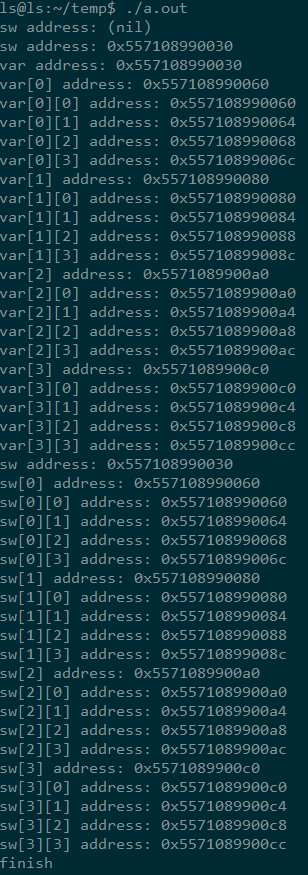

# 返回二维指针变量

<!--more-->

```c++
#include <iostream>
#include <assert.h>

#define DEL_ARR_MEM(P) if(NULL != (P)){delete [] (P); (P) = NULL;}

using namespace std;

#if 0
//c语言的用法
int** array2dAllocate(const int & n, const int & m)
{
    int** var = NULL;
    var = (int**)malloc(sizeof(int*) * n); //注：sizeof中是对int*求大小，因为是指针的指针
    assert(NULL != var);
    for (int ii = 0; ii < n; ii++)
    {
        var[ii] = NULL;
        var[ii] = (int*)malloc(sizeof(int) * m);
        assert(NULL != var[ii]);
    }
    return var;
}

void free2dArray(int ** var, const int &n, const int &m)
{
    for (int i = 0; i < n; ++i)
    {
        free(var[i]);
    }
    free(var);
}
#endif

#if 1
//c++的用法
int** array2dAllocate(const int & n, const int & m)
{
    int** var = NULL;
    var = new int*[n];
    assert(NULL != var);
    for (int ii = 0; ii < n; ii++)
    {
        var[ii] = NULL;
        var[ii] = new int[m];
        assert(NULL != var[ii]);
    }
    return var;
}

void free2dArray(int ** var, const int &n)
{
    for (int i = 0; i < n; ++i)
    {
        DEL_ARR_MEM(var[i]);
    }
    DEL_ARR_MEM(var);
}
#endif

int main()
{
    int n = 4;
    int m = 4;
    int** sw = array2dAllocate(n, m);

    for (int i = 0; i < n; i++)
    {
        for (int j = 0; j < m; j++)
        {
            cout << sw[i][j] << endl;
        }
    }
    free2dArray(sw, n);
    free2dArray(btrack, n);
    cout << "finish" << endl;
}
```

# 传入二维指针变量的分配方法

```c++
#include <iostream>
#include <assert.h>

#define DEL_ARR_MEM(P) if(NULL != (P)){delete [] (P); (P) = NULL;}

using namespace std;

void array2dAllocate(int** var, const int & n, const int & m)
{
    printf("var address: %p\n", var); //打印指针变量的值；若为&var则是该指针变量的地址
    assert(NULL != var);
    for (int ii = 0; ii < n; ii++)
    {
        var[ii] = NULL;
        var[ii] = new int[m];
        assert(NULL != var[ii]);
    }
        for (int ii = 0; ii<n; ii++)
        {
                printf("var[%d] address: %p\n", ii, var[ii]);
                for (int jj = 0; jj<m; jj++)
                {
                        var[ii][jj] = 2;
                        printf("var[%d][%d] address: %p\n", ii, jj, &var[ii][jj]);
                }
        }
}

void free2dArray(int ** var, const int &n)
{
    for (int i = 0; i < n; ++i)
    {
        DEL_ARR_MEM(var[i]);
    }
    DEL_ARR_MEM(var);
}

int main()
{
    int n = 4;
    int m = 4;
    int** sw = NULL;
    printf("sw address: %p\n", sw);
    sw = (int**)malloc(sizeof(int*) * n);
    printf("sw address: %p\n", sw);
    array2dAllocate(sw, n, m);
   // int** sw = array2dAllocate(n, m);

    printf("sw address: %p\n", sw);
    for (int i = 0; i < n; i++)
    {
        printf("sw[%d] address: %p\n", i,  sw[i]);
        for (int j = 0; j < m; j++)
        {
            //cout << sw[i][j] << endl;
            printf("sw[%d][%d] address: %p\n", i, j, &sw[i][j]);
        }
    }
    free2dArray(sw, n);
    cout << "finish" << endl;
}
```

输出结果如下图

