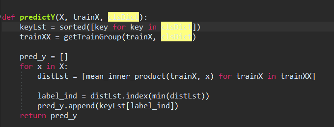
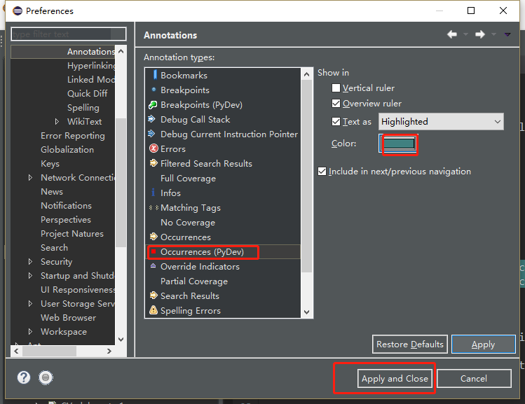
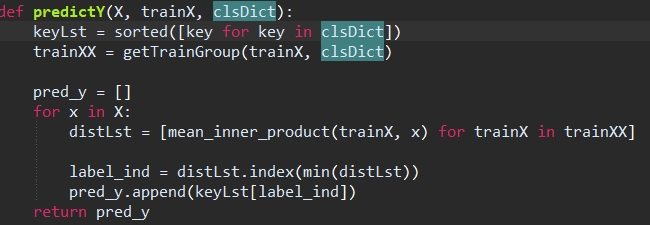

每次用eclipse安装pydev然后再开启其暗黑主题时，光标放到某个变量上简直闪瞎眼有没有！！！忍受了N个月后，实在是看不下去了，在某篇博客上找到一个解决办法

<!--more-->

修改显示的背景色：

Window->Preferences->General->Editors->Text Editors->Annotations->Occurrences

再看下效果是不是好多了

参考（第一个参考链接的修改是正解）：

1. [Eclipse修改相同内容的高亮显示（pydev编辑python）](https://blog.csdn.net/jerrygaoling/article/details/81116052)
2. [eclipse安装pyDev，并调整色彩配置以适应暗黑主题](https://blog.csdn.net/leejeff/article/details/80432103)