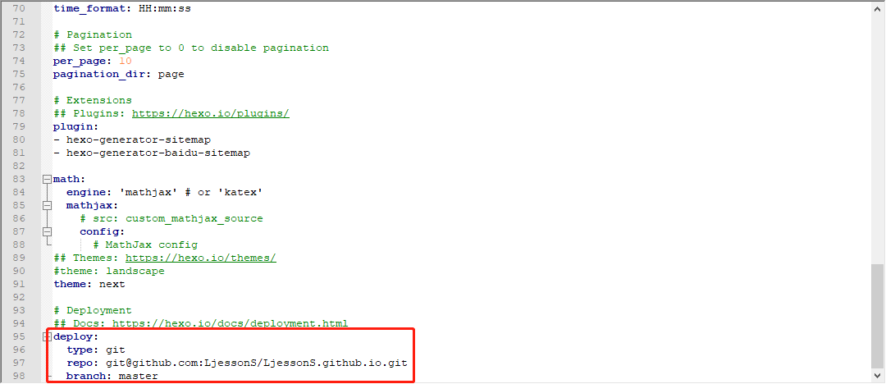
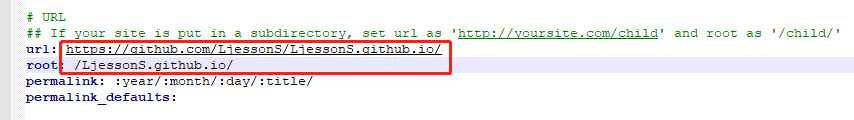
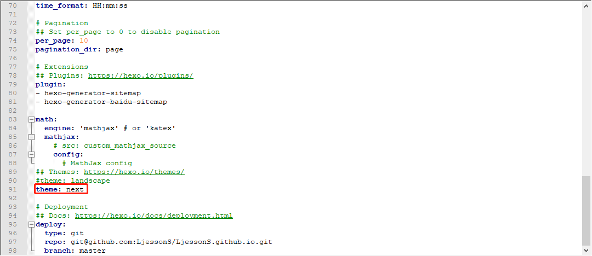
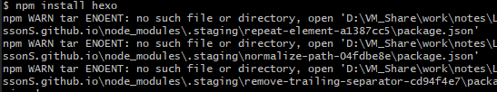
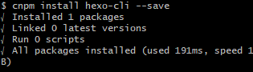
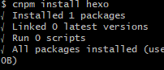
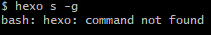
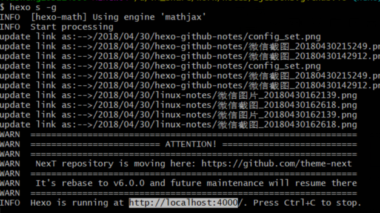

步骤：

1. 创建git账户，并将本地秘钥添加到github账户
2. 配置hexo环境
   - node.js
   - hexo插件
3. 配置站点_config.yml文件
   - 添加远程仓库
   - 支持数学公式
   - 更换主题
   - 页面内嵌入图片等
4. 配置主题(_config.ym,layout)
   - 为文章添加分类，标签
   - 文章之间的分割线等
5. 博客备份

<!-- more -->

# 1.github安装

略。

# 2.hexo环境安装

> 安装Node.js:在[Download | Node.js](https://link.zhihu.com/?target=https%3A//nodejs.org/en/download/) 下载安装包

安装完成后，检测Node.js是否安装成功

```shell
$ node -v
v8.11.1
$ npm -v
5.6.0
```

安装Hexo

```shell
$ npm install -g hexo-cli
```

初建博客

```shell
$ hexo init blog
$ hexo new test_my_site
$ hexo g #生成静态页面
$ hexo s #hexo server,用于启动本地服务器，预览网页
```

# 3.配置站点文件

- 设置git仓库地址



进阶配置，参考[**hexo+github搭建博客**](http://stevenshi.me/2017/05/07/hexo-blog/)

- 会影响页内图片显示的站点地址配置，另外图片的链接格式一定要是linux系统的**斜杠**，参见[hexo 报错 Cannot read property 'replace' of null](https://www.jianshu.com/p/449accb044b4)

  

  暂时不知道这个url有什么用，如果这个配置保持默认设置，是没问题的，但是一旦设置就一定要对，否则会报上面的错。

图片失效参考：[Hexo - 文章中插入图片](http://www.cubemister.com/Blog/2016/10/03/Hexo-%E6%96%87%E7%AB%A0%E4%B8%AD%E6%8F%92%E5%85%A5%E5%9B%BE%E7%89%87/)

# 4.主题配置

安装[next主题](http://theme-next.iissnan.com/)，将默认的landscape修改为next，为什么选择nexT，看看[这个帖子](http://www.mdslq.cn/archives/9c1d5c6d.html)就明白了。



访问量及阅读次数统计配置，参考[Hexo博客Next主题添加文章阅读量及网站访问信息](http://www.mdslq.cn/archives/d93ac7d.html)

添加搜索功能，参考[Hexo博客添加搜索功能](http://www.itfanr.cc/2017/10/27/add-search-function-to-hexo-blog/)

进阶配置，参考[**hexo+github搭建博客**](http://stevenshi.me/2017/05/07/hexo-blog/)

# 5.博客备份

hexo在github上部署的只是静态页面，并没有推送源文件，这样当我们换了一台电脑，就得重新搭一次博客，配置同样的样式，将hexo搭建博客的源文件放在github仓库的另一个分支可以避免这个繁琐的操作。

1. 用hexo搭好博客之后，在站点根目录（站点配置文件_config.yml同级目录）执行如下命令

   ```shell
   #当前在站点根目录
   $ git init
   $ git branch -m master hexo #远程yourname.github.io将会多一个除master分支外的hexo分支
   $ git remote add origin https://github.com/yourusername/yourusername.github.io.git
   $ vim .gitigonore #添加如下需要忽略的文件类型
       .DS_Store
       Thumbs.db
       *.log
       node_modules/
       public/
       .deploy*/
   $ git status #查看目前的提交状态
   $ git add --all
   $ git commit -m "backup source file" #提交博客源文件
   $ git push origin hexo #源文件被推送到远程分支
   ```

   **注：**当hexo分支不小心创建，无法将源文件推送到远程仓库时，可以用命令`git push origin :hexo`来删除删除远程hexo分支。

2. 验证博客备份是否成功，

   ```shell
   $ cd .. #退出到与刚才建博客不同的目录，相当于在新电脑上操作
   $ git clone https://github.com/yourusername/yourusername.github.io.git
   $ git branch -r #查看当前所处的分支
   $ git checkout hexo #切换到源文件所在的分支
   ```

   执行如下命令，在“新电脑上”安装hexo环境

   - npm install hexo-cli --save #在新电脑上配置hexo
   - npm install hexo --save
   - npm install hexo-server --save
   - npm install hexo-generator-search --save
   - npm install hexo-deployer-git --save
   - npm install hexo-asset-image --save
     - 注：需要设置站点配置文件`post_asset_folder: true`

   或者直接用npm install, npm会自动安装package.json中的各个包。我在公司电脑上试的时候，发现npm install会报下图中的错。

   

   这有可能是因为网络问题，安装不了包。需要使用cnpm命令安装

   ```shell
   $ npm i -g cnpm #安装cnpm
   ```

   然后我用`cnpm install`，甚至挨个安装，发现hexo还是不能识别

   

   

   

   专业做前端的好心朋友让我试试全局安装，然后就成功了

   ```shell
   $ cnpm install -g hexo-cli
   ```

   

   我觉得npm install可以直接安装，用`cnpm install -g`直接全局安装也是可行的。然后hexo能用了，我在公司的电脑上也就能用博客了。

   上面这个报错困扰了我一个上午，还是两个专业做前端的好心朋友教我的，在此衷心的感谢他们不吝赐教，真的很感谢你们！我很少向别人求助，经常一个问题卡很久，有时候会为自己浪费了太多时间感到后悔，这个问题要是没搞定，我可能会为这个问题纠结到明天无法安心上班T_T。

   然后可以开始新建并发布博客了

   ```shell
   hexo new post "new blog"
   hexo clean #clear old html file
   hexo s -g #生成静态页面，并启动本地服务器调试博客效果。
   hexo d -g #部署到远程
   git add .
   git commit -m "add new blog"
   git push #推送本地笔记源文件到远程
   ```

参考链接：

1. https://zhuanlan.zhihu.com/p/26625249
2. [【2018更新】小白独立搭建博客--Github Pages和Hexo简明教程](https://my.oschina.net/ryaneLee/blog/638440)
3. [hexo教程系列——hexo配置教程](https://blog.csdn.net/xuezhisdc/article/details/53130383)
4. [**hexo+github搭建博客**](http://stevenshi.me/2017/05/07/hexo-blog/)(站点配置及主题配置主要参考这篇博客)