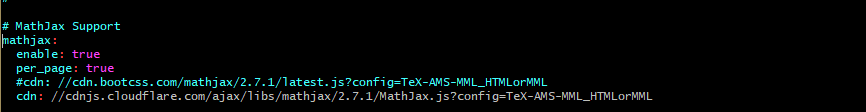
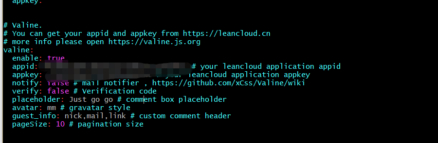

本打算不再折腾博客跟前端的东西，实在是太耗费时间了，但是无奈前天博客上数学公式发现居然不正常显示了了，这简直天都要塌下来了！不行，数学公式都不支持，还写什么博客！于是把本地环境删了，将服务器上的源文件拉下来，直接开始了我很早就学到的`cnpm install`大法，cnpm install安装不行啊，忘了什么报错了，开始网上查，有人说，要先用`npm cache clean --force`去清空npm的缓存，试了下果然可以，但是后来发现我混用cnpm和npm貌似把包的环境给搞坏了，导致了进入升级主题的弯路，但是好在绕了弯路后，我知道了为什么之前的配置为什么会导致博客上数学公式显示不正常了，那是因为mathjax的解析地址早就已经换了。废话不多说，叙述清楚中间的这些弯路一是很费时，二是也没必要，因为人家已升级，你这些经验也许就不管用了！直接进入正题！

首先给出当前的hexo版本

```shell
$ hexo version
INFO  [hexo-math] Using engine 'mathjax'
hexo: 3.7.1
hexo-cli: 1.1.0
os: Windows_NT 10.0.17134 win32 x64
http_parser: 2.8.0
node: 8.11.1
v8: 6.2.414.50
uv: 1.19.1
zlib: 1.2.11
ares: 1.10.1-DEV
modules: 57
nghttp2: 1.25.0
openssl: 1.0.2o
icu: 60.1
unicode: 10.0
cldr: 32.0
tz: 2017c
```

另外next主题是第5版的，在`git clone https://github.com/iissnan/hexo-theme-next themes/next`，看看仓库的提交时间，6个月前就已经停止维护了。

第6版也是目前的最新版，已经集成到了hexo官方github里了

```shell
$ git clone https://github.com/theme-next/hexo-theme-next.git themes/next
```

新版在安装插件时，发现数学公式的支持不是很好，遂弃之。等以后支持好了，我再用吧。

其次是应该安装的hexo插件

```shell
$ cat package.json
{
  "name": "hexo-site",
  "version": "0.0.0",
  "private": true,
  "hexo": {
    "version": "3.7.1"
  },
  "dependencies": {
    "gitment": "^0.0.3",
    "hexo": "^3.7.1",
    "hexo-asset-image": "git+https://github.com/CodeFalling/hexo-asset-image.git",
    "hexo-cli": "^1.1.0",
    "hexo-deployer-git": "^0.3.1",
    "hexo-generator-archive": "^0.1.4",
    "hexo-generator-baidu-sitemap": "^0.1.2",
    "hexo-generator-category": "^0.1.3",
    "hexo-generator-index": "^0.2.0",
    "hexo-generator-search": "^2.2.5",
    "hexo-generator-searchdb": "^1.0.8",
    "hexo-generator-sitemap": "^1.2.0",
    "hexo-generator-tag": "^0.2.0",
    "hexo-inject": "^1.0.0",
    "hexo-math": "^3.0.4",
    "hexo-renderer-ejs": "^0.3.0",
    "hexo-renderer-marked": "^0.3.2",
    "hexo-renderer-stylus": "^0.3.1",
    "hexo-server": "^0.2.2",
    "hexo-wordcount": "^3.0.2"
  },
  "description": "- npm install hexo-cli --save #在新电脑上配置hexo\r - npm install hexo --save\r - npm install hexo-server --save\r - npm install hexo-generator-search --save\r - npm install hexo-deployer-git --save",
  "main": "index.js",
  "devDependencies": {},
  "scripts": {
    "test": "echo \"Error: no test specified\" && exit 1"
  },
  "repository": {
    "type": "git",
    "url": "git+https://github.com/LjessonS/LjessonS.github.io.git"
  },
  "keywords": [],
  "author": "",
  "license": "ISC",
  "bugs": {
    "url": "https://github.com/LjessonS/LjessonS.github.io/issues"
  },
  "homepage": "https://github.com/LjessonS/LjessonS.github.io#readme"
}
```

<!--more-->

# 1.更改mathjax的解析地址

在next主题`_config.yml`文件中，修改cdn为如下的地址

```shell
#cdn: //cdn.bootcss.com/mathjax/2.7.1/latest.js?config=TeX-AMS-MML_HTMLorMML
cdn: //cdnjs.cloudflare.com/ajax/libs/mathjax/2.7.1/MathJax.js?config=TeX-AMS-MML_HTMLorMML
```



hexo数学公式的支持，不需要换成网上有人说的`hexo-renderer-kramed`插件，`hexo-renderer-marked`插件完全可以和上面的cdn搭配好，让数学公式在博客上正常显示。

# 2.valine评论配置

需要在[leancloud](https://leancloud.cn)官网新建一个comment类，然后在设置中拿到应用key的appid与appkey。



**注：**在安装插件时，统一使用npm安装，并且用save参数保存到本地，这样下次就可以直接用npm把所有的依赖都安装好，以下是当npm命令安装不管用时的万能操作。

```shell
$ npm config set registry https://registry.npm.taobao.org #让npm走国内镜像下载
$ npm cache clean --force #清除缓存
$ rm -rf node_modules #在报需要删除node_modules错误的时候使用
```


配置好了上面的两点，我的博客数学公式支持了，同时也解决了我对评论朝思暮想的新病。下面是我对博客主题的需求，现在记下来，后面就不用回想了。

# 3.博客主题需求

- 首先是hexo更新，然后是next主题更新

```shell
$ npm install -g npm-upgrade #这个命令下次还得验证下是否是用来更新hexo的
#如果不放心，就先把hexo和hexo-cli卸载，查了下仍旧没搞清楚hexo和hexo-cli的区别，hexo貌似是旧版的安装方法，hexo-cli是新版的安装方法？
#$ npm uninstall hexo-cli -g
#$ npm uninstall hexo -g

#next主题更新
$ git clone https://github.com/theme-next/hexo-theme-next.git themes/next
```

- 头像

```shell
$ cd hexo
$ ll source/images/totoro.jpg #hexo站点配置文件同级目录的source目录放置images
```

- 图片显示

```shell
$ npm install hexo-asset-image --save
#设置站点配置文件_config.yml中的post_asset_folder
$ vim _config.yml
post_asset_folder true
```

- 数学公式

```shell
#npm install hexo-math --save #hexo默认安装，可不用手动
#两个包都需要拿来验证数学公式的支持
$ npm uninstall hexo-renderer-marked --save
$ npm install hexo-renderer-kramed --save 
```

参见：

[Which MathJax CDN script should be used?](https://stackoverflow.com/questions/49300667/which-mathjax-cdn-script-should-be-used)

[Hexo 书写 LaTeX 公式时的一些问题及解决方法](https://jdhao.github.io/2017/10/06/hexo-markdown-latex-equation/)

- next主题目录，number设置为false
- 支持博客文章搜索

```shell
$ npm install hexo-generator-searchdb --save
```

- 支持部署到git仓库

```shell
$ npm install hexo-deployer-git --save
```

- 文章阅读次数、阅读时间、访问量、访客总数:在leancloud_visitors参数中设置，需要去leancloud官网添加一个类，并拿到appid和appkey。

- copyright：在next主题配置文件中设置
- 字数统计

```shell
$ npm uninstall hexo-wordcount --save #新版可能需要卸载原来过时的计数插件
$ npm install hexo-symbols-count-time --save #今天测试了新版的计数功能，貌似不能正常工作
```

参见：[Hexo NexT v6.3.0字数统计](https://co5.me/2018/180613-wordcount.html)

- 语言设置:新版next主题对应的中文主题为`zh-CN`,需要在站点配置文件`_config.yml`中修改`zh-Hans`为`zh-CN`

- 评论功能支持：valine新版也可以使用，有了评论功能后需要将关于页面的评论关掉，然后就是没篇博客的评论功能默认设置为`comments: true`