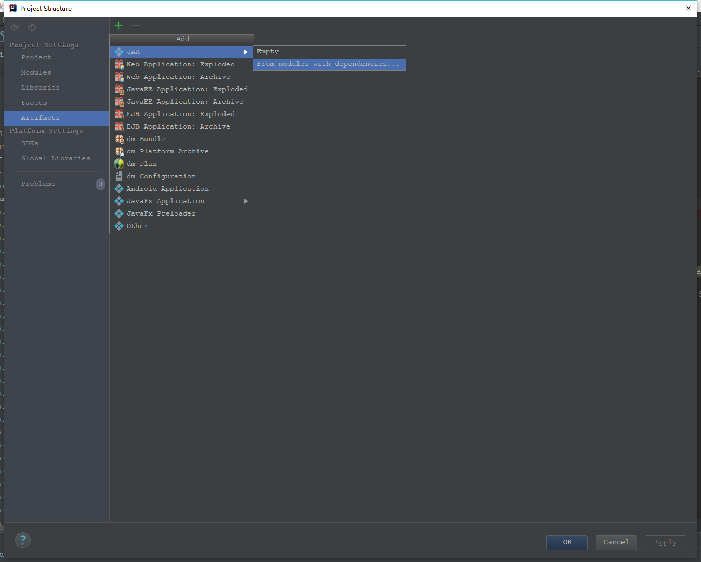
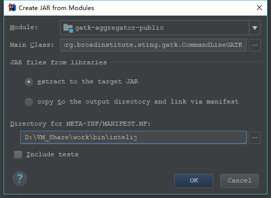
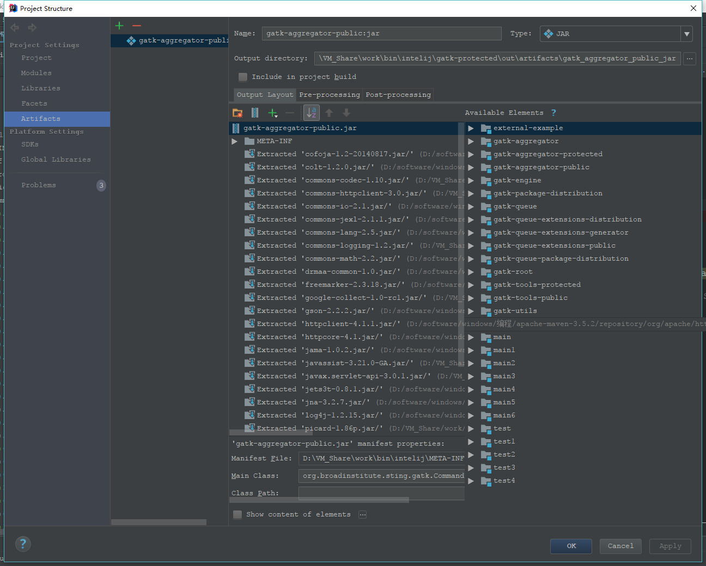
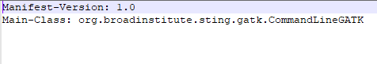

1.java如何用以追加模式写入文件到本地

```java
import java.io.BufferedWriter;   
import java.io.FileOutputStream;   
import java.io.FileWriter;   
import java.io.IOException;   
import java.io.OutputStreamWriter;   
import java.io.RandomAccessFile;   

public class WriteStreamAppend {  
      /** 
       * 追加文件：使用FileOutputStream，在构造FileOutputStream时，把第二个参数设为true 
       * 
       * @param fileName 
       * @param content 
       */  
public static void method1(String file, String conent) {   
    BufferedWriter out = null;   
    try {   
         out = new BufferedWriter(new OutputStreamWriter(   
                  new FileOutputStream(file, true)));   
                 out.write(conent);   
        } catch (Exception e) {   
            e.printStackTrace();   
        } finally {   
            try {   
                out.close();   
            } catch (IOException e) {   
                e.printStackTrace();   
            }   
        }   
    }   
  
    /** 
     * 追加文件：使用FileWriter 
     *   
     * @param fileName 
     * @param content 
     */  
    public static void method2(String fileName, String content) {   
        try {   
            // 打开一个写文件器，构造函数中的第二个参数true表示以追加形式写文件   
            FileWriter writer = new FileWriter(fileName, true);   
            writer.write(content);   
            writer.close();   
        } catch (IOException e) {   
            e.printStackTrace();   
        }   
    }   
  
    /** 
     * 追加文件：使用RandomAccessFile 
     *   
     * @param fileName 
     *            文件名 
     * @param content 
     *            追加的内容 
     */  
    public static void method3(String fileName, String content) {   
        try {   
            // 打开一个随机访问文件流，按读写方式   
            RandomAccessFile randomFile = new RandomAccessFile(fileName, "rw");   
            // 文件长度，字节数   
            long fileLength = randomFile.length();   
            // 将写文件指针移到文件尾。   
            randomFile.seek(fileLength);   
            randomFile.writeBytes(content);   
            randomFile.close();   
        } catch (IOException e) {   
            e.printStackTrace();   
        }   
    }   
  
    public static void main(String[] args) {   
        System.out.println("start");   
        method1("c:/test.txt", "追加到文件的末尾");   
        System.out.println("end");   
    }
```

<!--more-->

参考:[java 追加内容到文件末尾的几种常用方法](https://blog.csdn.net/jsjwk/article/details/3942167)

2. Intelij java工程打成可执行jar包

- 选中Java项目工程名称，在菜单中选择 File->project structure...

  

- 在弹出的窗口中左侧选中"Artifacts"，点击"+"选择jar，然后选择"from modules with dependencies"。

  

- 在配置窗口中配置"Main Class"。

- 配置“Directory for META-INF/MAINFEST.MF”，此项配置的缺省值是：D:\VM_Share\work\bin\intelij\gatk-protected\public\java\src，需要改成：D:\VM_Share\work\bin\intelij。如果不这样修改，打成的jar包里没有包含META-INF/MAINFEST.MF文件，这个应该是个IDEA的BUG。选择“extract to the target JAR”，这样所有依赖的jar包都会放在生成的jar包中。

  

- 完成后，点击OK，Apply等按钮，回到IDEA的主菜单，选择“Build - Build Artifacts”下的“Build”或者“Rebuild”即可生成最终的可运行的jar，在D:\VM_Share\work\bin\intelij\gatk-protected\out\artifacts\gatk_aggregator_public_jar下面找到生成的目标jar，可以看到META-INF/MAINFEST.MF文件被正确包含，内容也正确（含有main class）。

  

参考:[使用Intellij Idea打包java为可执行jar包](https://blog.csdn.net/xuemengrui12/article/details/74984731)