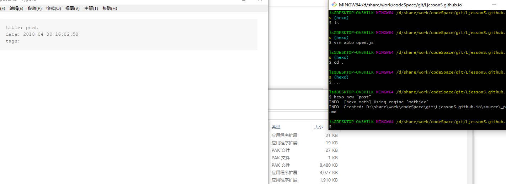
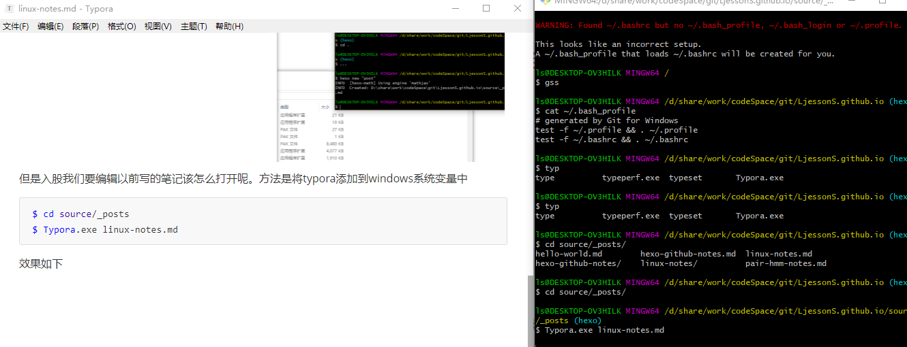

# linux使用技巧

记录一些有用有趣的技巧。

<!-- more -->

## 1.添加别名（对git bash也适用）

```shell
$ alias #可通过该命令查看系统中变量别名
$ vim ~/.bashrc #为常用工作路径添加别名，方便直接进入
alias gss='cd /d/share/work/codeSpace/git/LjessonS.github.io/source/_posts'
alias ...='cd ..' #输入...直接能进入上层目录
$ source ~/.bashrc #让别名生效
```

## 2.创建博客自动用编辑器打开markdown文件

在站点根目录scripts文件夹，若没有则创建一个，然后在scripts文件夹中创建一个auto_open.js的脚本文件

```shell
$ mkdir scripts 
$ vim scripts/auto_open.js
```

输入如下脚本：

```javascript
var spawn = require('child_process').exec;
// Hexo 2.x 用户复制这段
//hexo.on('new', function(path){
//  spawn('start  "markdown编辑器绝对路径.exe" ' + path);
//});
//C:\Program Files\Typora\Typora.exe 是typora编辑器在我本地的路径！
// Hexo 3 用户复制这段
hexo.on('new', function(data){
  spawn('start  "C:\Program Files\Typora\Typora.exe" ' + data.path);
});
```

这样，以后每次新建一个博客都能用typora直接打开。效果图如下：



但是如果我们要编辑以前写的笔记该怎么打开呢。方法是将typora添加到windows系统变量中

```shell
$ cd source/_posts
$ Typora.exe linux-notes.md #事先已经将typora添加进系统环境变量
```

效果如下



参考链接：

1. [Hexo 建立新文章後自動打開編輯器跟瀏覽器](https://thisis577.github.io/2016/08/05/auto-open-editor-and-browser-after-hexo-new-post/)
2. [hexo 写文章创建文件自动打开编辑器！](https://www.jianshu.com/p/5fbb62791f9b)