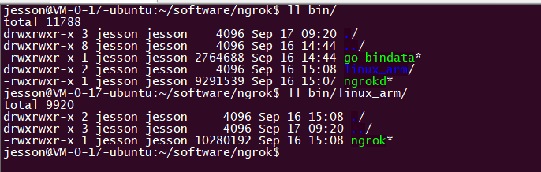
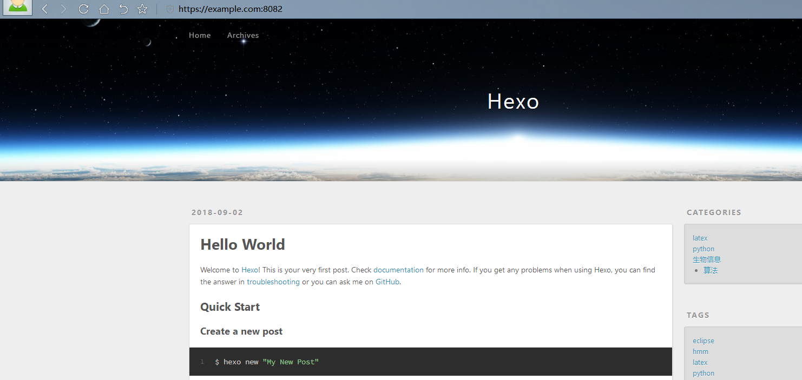

# 1.安装go语言

```shell
#从https://golang.org/dl/下载合适的版本
$ tar -C /usr/local -xzf go1.11.linux-armv6l.tar.gz
$ vim /etc/profile #（或在$HOME/.profile中）添加go环境变量
export PATH=$PATH:/usr/local/go/bin
$ source /etc/profile #（或source $HOME/.profile中）go环境生效
$ go version #验证配置成功
go version go1.11 linux/arm
```

<!--more-->

# 2.编译ngrok

​	ngrok的配置分别是在云服务器和树莓派(本地)，云服务器需要启动ngrok的服务(ngrokd)，而树莓派上需要使用ngrok的客户端，即从云服务器拷贝一个编译为树莓派对应arm系统的二进制文件(ngrok）。

**云服务器端配置**

```shell
$ git clone https://github.com/inconshreveable/ngrok.git #下载ngrok源代码
$ cd ngrok

#为域名生成自签名证书
$ export NGROK_DOMAIN="example.com" #注意替换此处域名
$ openssl genrsa -out rootCA.key 2048
$ openssl req -x509 -new -nodes -key rootCA.key -subj "/CN=$NGROK_DOMAIN" -days 5000 -out rootCA.pem
$ openssl genrsa -out device.key 2048
$ openssl req -new -key device.key -subj "/CN=$NGROK_DOMAIN" -out device.csr
$ openssl x509 -req -in device.csr -CA rootCA.pem -CAkey rootCA.key -CAcreateserial -out device.crt -days 5000

cp rootCA.pem assets/client/tls/ngrokroot.crt
cp device.crt assets/server/tls/snakeoil.crt
cp device.key assets/server/tls/snakeoil.key
```

**编译ngrok**

```shell
$ make release-server #编译生成云服务器端要用的ngrokd二进制文件,服务器端本就是linux系统，试验过了不需要添加参数GOOS=linux GOARCH=amd64
#以下是不同系统版本或者系统上的交叉编译方式
#64位linux server
#make release-server GOOS=linux GOARCH=amd64
#32位linux server
#make release-server GOOS=linux GOARCH=386
#go支持交叉编译的平台非常多，详见 GO中文文档:https://wizardforcel.gitbooks.io/golang-doc/content/13.html

#执行ngrokd
$ ./bin/ngrokd -tlsKey="assets/server/tls/snakeoil.key" -tlsCrt="assets/server/tls/snakeoil.crt" -domain="$NGROK_DOMAIN"  -httpAddr=":8081" -httpsAddr=":8082"
```

出现以下内容，说明编译成功

```shell
[09:08:16 CST 2018/09/17] [INFO] (ngrok/log.(*PrefixLogger).Info:83) [registry] [tun] No affinity cache specified
[09:08:16 CST 2018/09/17] [INFO] (ngrok/log.Info:112) Listening for public http connections on [::]:8081
[09:08:16 CST 2018/09/17] [INFO] (ngrok/log.Info:112) Listening for public https connections on [::]:8082
[09:08:16 CST 2018/09/17] [INFO] (ngrok/log.Info:112) Listening for control and proxy connections on [::]:4443
[09:08:16 CST 2018/09/17] [INFO] (ngrok/log.(*PrefixLogger).Info:83) [metrics] Reporting every 30 seconds
```

之后Ctrl+C退出ngrokd，继续来编译ngrok客户端

```shell
$ make release-client GOOS=linux GOARCH=arm #编译生成树莓派端要用的ngrok二进制文件，一定要带上参数GOOS=linux GOARCH=arm
#以下是不同系统的编译方式
#linux
#make release-client GOOS=linux GOARCH=amd64
#OS X
#make release-client GOOS=darwin GOARCH=amd64
#win
#make release-client GOOS=windows GOARCH=386
#armv6l
#make release-client GOOS=linux GOARCH=arm
```

可以看到在bin目录下生成了树莓派上需要的ngrok文件，我们将这个文件再拷贝到树莓派上，进行树莓派本地的配置



# 3.树莓派本地配置

```shell
$ vim ngrok.yml
#注意缩进用空格，几个空格无所谓，但是要保持同层级对齐
#hostname: "example.com:8082"就是你最后在公网用来访问树莓派的网址，8082端口是你在云服务器上开放的http或https端口，注意，若域名没有备案，则用https的端口，备案的了话就用可以http的端口
server_addr: "example.com:4443"
trust_host_root_certs: false
tunnels:
  pi:
    hostname: "example.com:8082" #就是你最后在公网用来访问树莓派的网址
    #subdomain: pi #如果带上子域名，最终的访问方式就是pi.example.com：8082，没有设置的话随机分配
    proto:
      https: "80" #域名若备案，可以用http，没备案用https
  ssh:
    remote_port: 8084 #这个端口是最后通过ssh远程访问树莓派的端口号
    proto:
      tcp: "22"
```

# 4.运行测试

```shell
#在云服务器上启动ngrok服务,可以用nohup或screen保持后台运行
$ ./bin/ngrokd -tlsKey="assets/server/tls/snakeoil.key" -tlsCrt="assets/server/tls/snakeoil.crt" -domain="$NGROK_DOMAIN"  -httpAddr=":8081" -httpsAddr=":8082"
#在树莓派上运行ngrok
$ ./ngrok --config ngrok.yml start pi ssh
ngrok                                                                                                                                                         (Ctrl+C to quit)    
Tunnel Status                 online                                                   
Version                       1.7/1.7                                                   
Forwarding                    tcp://example.com:8084 -> 127.0.0.1:22                   
Forwarding                    https://example.com:8082 -> 127.0.0.1:80                 
Web Interface                 127.0.0.1:4040                                           
# Conn                        0                                                         
Avg Conn Time                 0.00ms                              
```

最后通过ssh就可以远程访问树莓派了

```shell
$ ssh pi@example.com -p 8084 
```

在浏览器中打开`https://example.com:8082`就能看到部署在树莓派上的博客(注意替换此处的域名)



# 5.后台挂起

```shell
#云服务器端
$ vim ngrok.sh #写入以下内容
path=/home/jesson/software/ngrok
NGROK_DOMAIN=example.com
${path}/bin/ngrokd -tlsKey="assets/server/tls/snakeoil.key" -tlsCrt="assets/server/tls/snakeoil.crt" -domain="$NGROK_DOMAIN"  -httpAddr=":8081" -httpsAddr=":8082"

$ nohup sudo sh ngrok.sh #不要用nohup sudo sh ngrok.sh & 否则可能错过输入密码，然后关闭当前shell即可，经测试树莓派端仍可连接

#树莓派端
$ vim ngrok.sh
./ngrok --config ngrok.yml start pi ssh
$ nohup sudo sh ngrok.sh #同上，经测试关闭secureCRT,仍能远程访问树莓派，网页输入https://example.com:8082仍然可以看到树莓派上的博客
```

# 6.从另一台电脑克隆树莓派git仓库

```shell
$ git clone ssh://git@example.com:8084/home/git/blog/hexo.git
```

参考：

- [Ngrok编译](https://my.oschina.net/dingdayu/blog/1525454)

- [搭建支持外网访问的树莓派Web服务器](https://i.itest.ren/2016/07/22/RaspberryPi-ngrok-ittun.com/)

  > 另外，我的网站没有备案，所以在最后的协议那里写的是`https: 80`，如果是备案域名的话，写`http: 80`。

- [Ngrok完美实现内网穿透](https://zhuanlan.zhihu.com/p/29019562)

- [git客户端连接ssh端口不是22的gitlab](https://blog.csdn.net/intergameover/article/details/50186239)