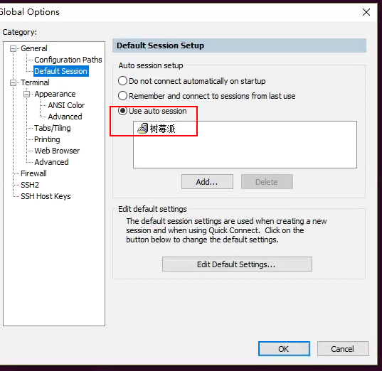

# 1.设置启动secureCRT自动连接某个服务器

> 在global option----General---Default Session .右边选择Use auto session.添加选择需要启动自动连接的session。可以添加多个。

参见:[secureCRT使用心得---自动登录服务器，自动执行脚本及自动](http://www.voidcn.com/article/p-usjvvxca-bbk.html)