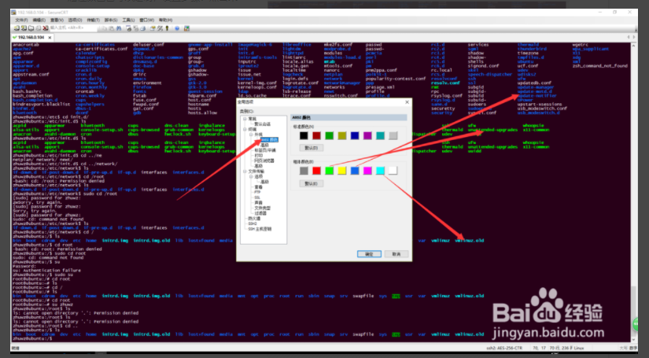
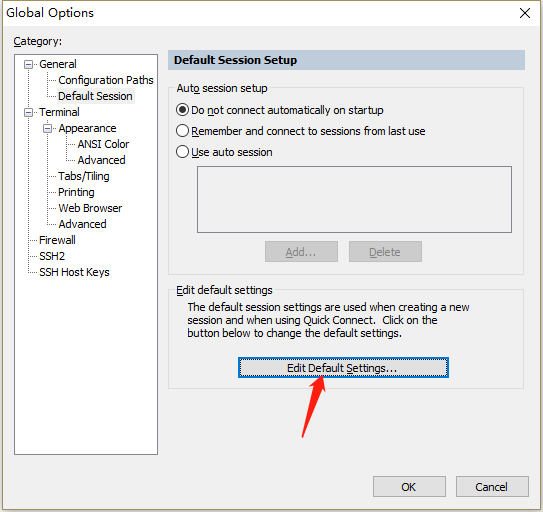
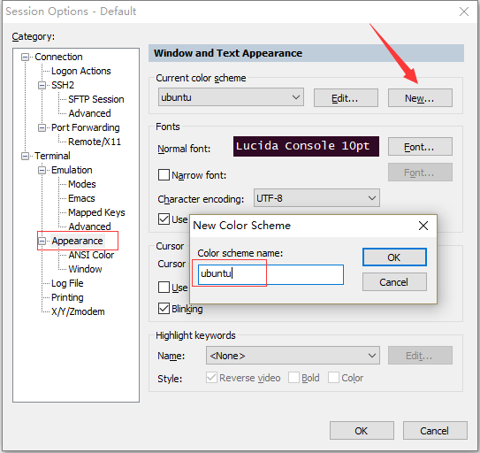
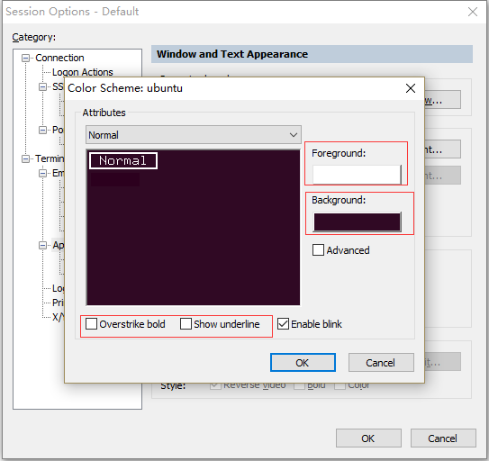
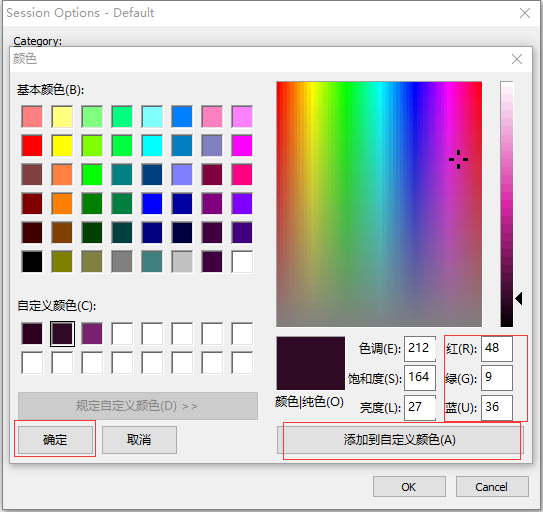
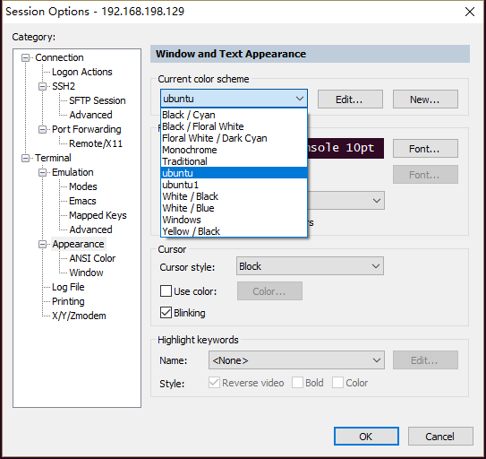
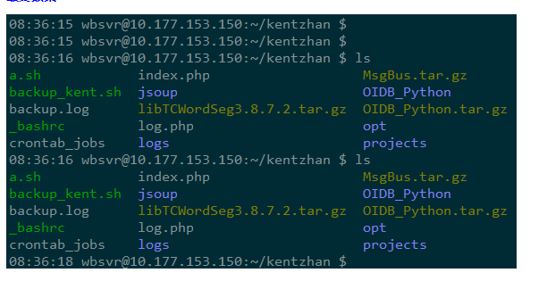

第一种方案：

步骤：

- Global Options->default sessions->edit default sessions

  

- Appearance->New color scheme

  

- normal：

  - fore ground设置为白色就可以了
  - Background 

  

  

- 全都ok后，点击sessions options->appearance选择刚才添加的配色方案，ok即可

  

参考：[Secure CRT设置配色方案](https://jingyan.baidu.com/album/c843ea0bc1b82d77931e4ad5.html?picindex=17)

第二种方案：

参考：

1.[SecureCRT 绝佳配色方案, 保护你的眼睛 ](https://note.youdao.com/share/?id=776f1157d5c60111f17614203198c055&type=note#/)

2.[secureCRT,永久设置,保护眼睛,配色方案](https://www.cnblogs.com/firstcsharp/p/7419938.html)