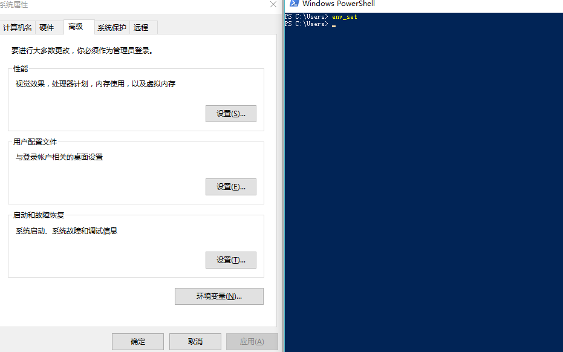
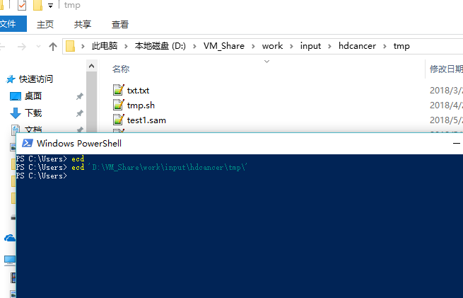

这两个配置文件也是从同事那里拷贝过来的，分别是ecd和env_set两个命令，ecd能让你很方便的打开目录，env_set可以让你很快的打开环境变量设置界面

### env_set配置

```bash
#将下面的命令放在gvim安装目录Vim\vim80
#新建一个env_set.bat并写入下面的代码
@echo off
 "C:\Windows\System32\SystemPropertiesAdvanced.exe"

@echo on 
```

### ecd配置

```shell
#将下面的命令放在gvim安装目录Vim\vim80
#新建一个ecd.bat并写入下面的代码
@echo off
if  "%1%"=="" (
::echo %1%
pushd %cd%
explorer.exe /e, %cd%
popd
)else explorer.exe /e, %1%

@echo on 
```

然后在powershell中使用如下命令就可以打开目录和环境变量界面了



ecd默认打开当前目录，如果后面带上路径就是打开指定目录

