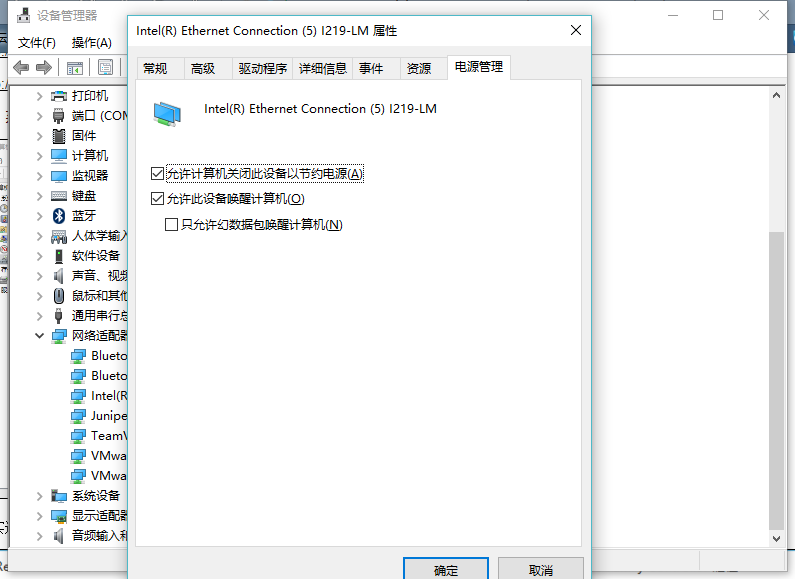
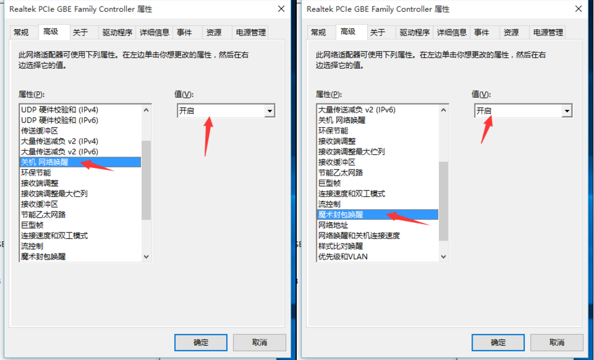

准备工具：

- windows10台式电脑
- 与台式电脑同处一个局域网中的树莓派
- 可远程访问树莓派(本文默认已经具备该条件)

# 1.windows台式电脑配置

在设备管理器中设置网卡可以唤醒，我的win10默认就是开启的，有人说可能需要取消勾选【允许计算机关闭此设备以节约电源】，我的台式是默认勾选的，可以远程开机





然后需要在bios中设置开启【由PCI-E/PCI设备唤醒】，这里我是直接截的第一个参考链接中的图，不同电脑大同小异


# 2.树莓派配置

## 2.1第一种办法

在第一个参考链接中，是用的etherwake，但是亲测不可行，用另一个命令wakeonlan是可以的

```shell
#在树莓派中安装wakeonlan
$ sudo apt-get install wakeonlan
```

## 2.2第二种办法

在网上查到一种用python脚本去唤醒的方式，但是运行这个脚本去唤醒貌似比上面用官方包去唤醒要慢一些，但是也是可行的

```python
#!/usr/bin/python
# -*- coding: UTF-8 -*-

import socket
import struct
import sys
#import pdb
 
def wake_on_lan(mac, broadcast_ip=None):
    if len(mac) == 17:
        mac = mac.replace(mac[2], '')
    if len(mac) != 12:
        raise ValueError("Invalid MAC address")
    
    data = 'FFFFFFFFFFFF%s' %(mac*16)
    magic_data = ''
    
    for i in range(0, len(data), 2):
        magic_data = ''.join([magic_data, struct.pack('B', int(data[i:i+2], 16))])
            
    sock = socket.socket(socket.AF_INET, socket.SOCK_DGRAM)
    sock.setsockopt(socket.SOL_SOCKET, socket.SO_BROADCAST, 1)
    
    if not broadcast_ip:
        broadcast_ip = '255.255.255.255'
            
#	sock.sendto(magic_data, (broadcast_ip, 0))
    sock.sendto(magic_data, (broadcast_ip, 7))
    sock.sendto(magic_data, (broadcast_ip, 9))
	
if __name__ == '__main__':
    #传入PC网卡的MAC
    if len(sys.argv) >= 3:
        broadcast_ip = sys.argv[2]
    else:
        broadcast_ip = '255.255.255.255'

    #pdb.set_trace()
    wake_on_lan(sys.argv[1], broadcast_ip)
    exit(0)
```

将上面的代码写入一个新建的文件中，如wake_on_lan.py

# 3.测试

```shell
#在树莓派中输入以下命令，其中12:32:E4:12:55:12是windows10台式电脑的mac地址
$ wakeonlan 12:32:E4:12:55:12是windows10台式电脑的mac地址

#或执行上面的第二种办法
$ python wake_on_lan.py 12:32:E4:12:55:12
```

参考：

- [树莓派实现远程开机局域网电脑（WOL协议+etherwake+华硕主板Z97）秒变花生壳开机棒](https://www.cnblogs.com/EasonJim/p/6116143.html)
- [小区网络利用树莓派对其他电脑实现远程开机](https://blog.csdn.net/theodore26/article/details/51426640)
- [使用树莓派实现远程开机](https://blog.csdn.net/wuyemenghuirt/article/details/59640303)

其他可以参考的连接：

- [网络唤醒原理浅析(Wake On LAN)](https://www.tinyx.cc/network/network-experience/wol-principle.html)
- [如何远程开启你的电脑：WoL的原理和陷阱](https://zhuanlan.zhihu.com/p/28859620)
- [python 实现微信远程控制唤醒内网机器和远程关闭windows 主机](https://awen.me/post/3709919605.html)
- [局域网唤醒（WOL）与远程唤醒教程](https://blog.csdn.net/zbgjhy88/article/details/68954888)