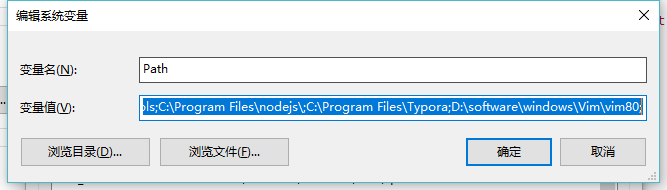

git bash需要使用ctrl+insert来复制，shift+insert来拷贝，有点麻烦，用gvim可以让vim使用ctrl+c,ctrl+v来复制拷贝，但是还有其他的好处，即使gvim比git bash中的vim好用并且好看多了！

<!--more-->

1. 下载安装[gvim](https://gvim.en.softonic.com/)

2. 配置`Vim\vim80\vimrc_example.vim`

   这个配置文件是同事给我的，换上他的配置文件会让你的gvim界面变成蓝屏风格，强迫症慎用！

   在替换之前，最好备份原始文件

   ```shell
   #open cmd
   > copy vimrc_example.vim vimrc_example.vim.bak
   ```

   然后将vimrc_example.vim中的内容替换成下面的代码

   ```shell
   " An example for a vimrc file.
   "
   " Maintainer:	Bram Moolenaar <Bram@vim.org>
   " Last change:	2016 Jul 28
   "
   " To use it, copy it to
   "     for Unix and OS/2:  ~/.vimrc
   "	      for Amiga:  s:.vimrc
   "  for MS-DOS and Win32:  $VIM\_vimrc
   "	    for OpenVMS:  sys$login:.vimrc

   " When started as "evim", evim.vim will already have done these settings.
   if v:progname =~? "evim"
     finish
   endif

   " Get the defaults that most users want.
   source $VIMRUNTIME/defaults.vim

   if has("vms")
     set nobackup		" do not keep a backup file, use versions instead
   else
     "set backup		" keep a backup file (restore to previous version)
     if has('persistent_undo')
       set undofile	" keep an undo file (undo changes after closing)
     endif
   endif

   if &t_Co > 2 || has("gui_running")
     " Switch on highlighting the last used search pattern.
     set hlsearch
   endif

   " Only do this part when compiled with support for autocommands.
   if has("autocmd")

     " Put these in an autocmd group, so that we can delete them easily.
     augroup vimrcEx
     au!

     " For all text files set 'textwidth' to 78 characters.
     autocmd FileType text setlocal textwidth=78

     augroup END

   else

     set autoindent		" always set autoindenting on

   endif " has("autocmd")

   " Add optional packages.
   "
   " The matchit plugin makes the % command work better, but it is not backwards
   " compatible.
   if has('syntax') && has('eval')
     packadd matchit
   endif

   set nu

   set guifont=Consolas:h14
   colorscheme darkblue

   if &diff
     "diff mode
     set diffopt+=iwhite
   endif

   set autoread

   ```

3. 将vim80目录添加到环境变量

   


