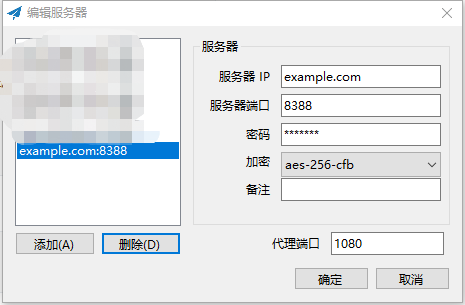
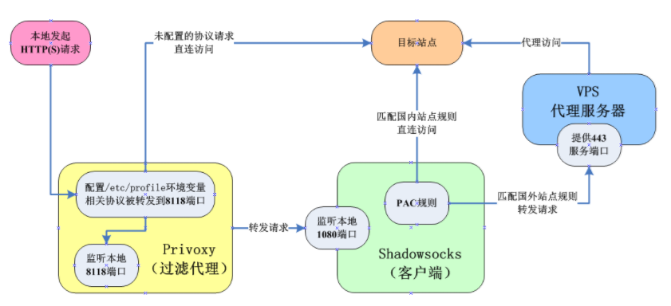

​	以前不明白ss服务器跟shadowsock有什么关系，查到的教程都是搭建ss服务器都会安装shadowsocks，猜测搭建ss服务器就是就是shadowsocks的部署过程。

# 1.服务端配置

- 在腾讯云上安装shadowsocks

```shell
$ pip install shadowsocks
```

- 创建shadowsock配置文件

```shell
$ vim shadowsocks.json
#把下面的内容添加进去
{
  "server": "0.0.0.0", #参考链接中有人试过别的地址，说是不行，我也没试其他的，能用就行
  "server_port": 8388, #这个端口应该无所谓，我试过改成其他ip，开启全局代理，仍然可以打开网页
  "password": "abcdefg",
  "method": "aes-256-cfb" #加密方式挺多的，如cr4-md5
}
```

- 在腾讯云服务器上启动ss服务

```shell
#-c是配置文件的路径，在终端输入ssserver可以查看各个参数的描述
$ ssserver -c shadowsocks.json -d start
```

# 2.客户端配置

貌似在官网[shadowsocks](https://shadowsocks.org/en/index.html)下载适合不同系统的安装方式，这个我没试，用的是以前的客户端。



服务器ip填你的腾讯云域名(或者公网ip?)就行，其他的跟前面在腾讯云服务器上的配置基本一样。

# 3.验证

​	**将shadowsocks设置成全局代理**，然后在浏览器中搜索本机ip地址，**如果显示为腾讯云服务器的ip地址说明ss服务器就算搭建成功了**。注意腾讯云上使用`ifconfig`命令可能跟你在浏览器中的ip地址不一样，那是因为服务器显示的是本地局域网中的ip地址，可以使用下面的命令查看腾讯云服务器的外网ip，这个ip才是跟你在浏览器中显示的一样的。

```shell
#注，下面这个如果很久没有响应的话就网上搜下，多试几个
$ curl icanhazip.com
```

# 4.在linux系统中配置ss客户端

​	shadowsocks使用的协议是socks，而proxy所发出的代理是http协议，要让两者能够通讯，就要使用Privoxy，Privoxy是一个轻量的代理服务器，与之相似的还有Squid等，不过Privoxy比较简单易用。



## 4.1配置privoxy

```shell
$ sudo apt-get install privoxy #注，有些人用yum -y install privoxy,对于ubuntu而言，默认软件包管理器不是yum，而是dpkg，因此安装软件时要用 apt-get 来替换 yum 安装
$ vim shadowsocks.json
{
    "server":"SERVER-IP",           # 你的服务器ip
    "server_port":PORT,             # 服务器端口
    "local_address": "127.0.0.1",   # 本地ip
    "local_port":1080,              # 本地端口
    "password":"PASSWORD",          # 连接 ss 密码
    "timeout":300,                  # 等待超时
    "method":"chacha20",            # 加密方式
    "fast_open": false,             # tcp_fastopen
    "workers": 1                    #工作线程数
}
$ echo 'forward-socks5 / 127.0.0.1:1080 .' >> /etc/privoxy/config
#有些人自定义了pac.action,但是我使用这种方式，用curl www.google.com命令来验证的时候，发现结果返回特别慢（actionsfile pac.action）

#设置privoxy监听端口
$ vim /etc/profile
# privoxy 默认监听端口为 8118,添加一下内容
proxy="http://127.0.0.1:8118"
export http_proxy=$proxy
export https_proxy=$proxy


#启动shadowsocks代理
$ sslocal -c shadowsocks.json
# 启动privoxy服务
$ service privoxy start #sudo /etc/init.d/privoxy start
```

## 4.2安装gfwlist2privoxy

```shell
# 将在线的gfwlist转换为privoxy能用的格式，可用于更新privoxy的代理规则
$ pip install gfwlist2privoxy
$ gfwlist2privoxy -f pac.action -p 127.0.0.1:1080 -t socks5
$ vim /etc/privoxy/config #将原来的"forward-socks5 / 127.0.0.1:1080 ."注释掉，修改为下面的内容
actionsfile pac.action
```

## 4.3验证端口

```shell
# 验证Shadowsocks
$ netstat -an | grep 1080
# 1080是Shadowsocks服务的端口号
# 如果出现以下，则说明服务正常
tcp        0      0 127.0.0.1:1080          0.0.0.0:*               LISTEN     
udp        0      0 127.0.0.1:1080          0.0.0.0:* 

# 验证Privoxy
$ netstat -an | grep 8118
# 8118是Privoxy服务的端口号
# 如果出现以下，则说明服务正常
tcp        0      0 192.168.1.163:8118      0.0.0.0:*               LISTEN 
```

## 4.4验证ss客户端是否配置

```shell
$ curl www.google.com #不要用ping，出现以下内容说明配置成功，以后终端也能科学上网了
<!doctype html><html itemscope="" itemtype="http://schema.org/WebPage" lang="en"><head><meta content="Search the world's information, including webpages, images, videos and more. Google has many special features to help you find exactly what you're looking for." name="description"><meta content="noodp" name="robots"><meta content="text/html; charset=UTF-8" http-equiv="Content-Type"><meta content="/logos/doodles/2018/fall-equinox-2018-4647428262199296-law.gif" itemprop="image"><meta content="Fall Equinox 2018" property="twitter:title"><meta content="Fall Equinox 2018! #GoogleDoodle" 
```

参考链接：

- [搭建ss服务器和配置ss客户端](https://blog.csdn.net/hereis00/article/details/79552003)
- [用Linux命令行获取本机外网IP地址](https://blog.csdn.net/lakeheart879/article/details/78247894)

在linux上使用命令行走pac模式的技术

- [Ubuntu 16.04 安装ss客户端](https://blog.csdn.net/thor_w/article/details/79504804)
- [centos7 安装shadowsocks客户端](https://blog.csdn.net/guyan0319/article/details/72681796)
- [sslocal + privoxy 实现 PAC 代理](https://blog.sliang.xyz/2017/12/12/sslocalprivoxy-%E5%AE%9E%E7%8E%B0-pac-%E4%BB%A3%E7%90%86/)
- [将GFWList转换为Privoxy格式的文件](https://my.oschina.net/pfma/blog/870729)
- [强大的代理调度器代理Privoxy](https://www.igfw.net/archives/1178)
- [用SS+Privoxy+树莓派让Node爬虫科学上网](https://segmentfault.com/a/1190000009251798)
- [Centos + Shadowsocks客户端 + Privoxy实现外网访问](http://exp-blog.com/2018/07/04/pid-1591/)
- [VPS一键搭建PAC代理服务器脚本，比SS翻墙更简单](http://www.glseo.cc/post-103.html)
- [Shadowsocks-qt5+gfwlist(genpac)设置Deebin(Linux)PAC全局代理](https://blog.csdn.net/sos218909/article/details/78781017)