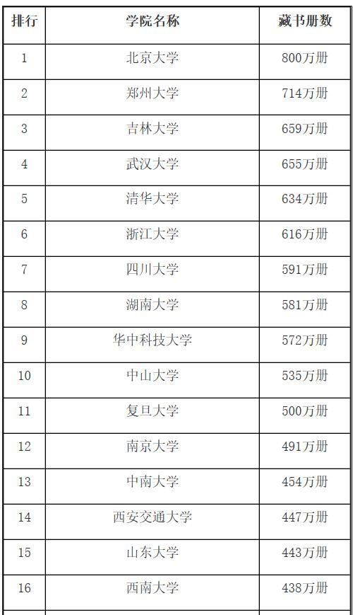

# 1.申请美国大学的几种方式

​	一般作为美国大学来说，在录取时候，有以下几种方式 ed (提前决定录取)，ea（提前行动），rd （常规录取） ro（滚动录取）。ed，ea是美国大学本科提前申请的二种申请方式，这二者申请方式，从字面上可以看出，无疑都是占得先机不错的机会。通常说来ed/ea的录取率要远远高于rd（regular decision）。通常占学校所录取学生的20%-50%。所以，这也是申请者有条件申请ed/ea抓住机会的根本原因。

​    **ed**是early decision提前决定录取，此类申请**要求申请人只能申请一所学校，如果获得学校录取就一定要去**。截止日期一般在10月底11月初，或11月中。通常在12中旬左右出结果。**不影响rd申请。但ed录取后必须withdraw已经申请好的rd的学校，否则会影响申请其他学校的学生被录取的机会。**

​    **ea**即 early action早行动，**有两种，一种是要求只能申请一所，另一种是可以申请多所**，和ed(提前决定)的区别是，录取了不一定去。被录取后也可以不放弃申请常规录取的学校。

​    rd: regular decision。**常规录取**，同时申请多个学校。截至通常在12月底到来年的2月1日。

​    ro:rolling，**滚轮录取，是学校有截止日期，但没有固定的发录取日子**。申请材料越早，越早被审理，录取机会就越大。采取**先申请先得**的政策。

**EA和ED申请的区别和优劣势比较**
​    对于美国大学这二种抓住机会“提前录取”的方式，ed与ea有何区别呢？

​    首先，先来看ed (early decision)与ea(early action)的共同点。二者在美国相当于国内高考的提前录取。无论是ed/ea，其申请截止日期上一般在每年的11月1日或11月中旬之前，录取结果在12月中旬就会公布。此外，ed/ea的适用对象都以申请美国排名前五十的大学学生为主。

​    虽然二者之间有共性，但是ea，ed也要区别来看，首先对于ed来说，它只能申请一所学校，而ea可以申请多所。如果学生通过ed被学校录取，学生必须到该所学校按受就读，而ea则对学生没有强制的要求。

​    那么ed.ea申请到底有什么优势了：一是ed虽然只能申请一个学校，但是录取率比ea要高一些，比如2007-2008年度，杜克大学的提前决定ed录取率为38%而正常录取rd的录取率为20%。而根据college board的数据，大部分顶尖的大学在提前申请的时候，就已经录取了当年录取总数的25%到50%的人数；近年来，常春藤盟校有40%的学生是提前申请时就被录取了。2010年的数据显示，耶鲁大学ea录取率为18.1%,斯坦福大学的ea录取率为16.2%,哥伦比亚大学ed录取率为23.8%，杜克大学ed录取率为38.3%，布朗大学ed录取率为22.6%

​    二是ed，ea的院校比较多，全美有大概400多所，同学可以根据自己的需求选择合适学校；二是录取结果早知道，也就是说通过ed,ea申请本科一般在12月中旬就可能知道是否已被录取，如若录取就省下大量精力和时间去做入学前准备了。如果没有被录取，那么可以继续申请rd也就是常规录取的学校，且不造成影响。

参考:

- [栾新静的回答](https://www.zhihu.com/question/26578928)

# 2.什么是微缩胶片？

- 其用途是复制书籍、报纸等纸质出版物上的文字和图片，在图书馆、档案馆等机构中应用较多。
- 存储信息密度高，是纸质书籍的2%
- 比原物能保存更多时间，通常时间能保存50年，标准条件下可保存几百年。
- 与计算机技术、通信技术结合，可以实现自动化信息检索。
- 其不足之处是必须借助微缩胶片阅读机或微缩阅读复印机才能阅读；保存条件非常严格。

​	在《大学之路》--田园诗般的常青藤大学一章中，作者提到普林斯顿大学的图书馆藏书总量是1300万册（2015年），不过其中大约一半多一点是纸质书，其余均为**微缩胶片**，而耶鲁大学的馆藏量是1270万册（2015年），其中纸质书的数量超出耶鲁大学很多。如何理解这两所大学的藏书量呢，我们可以对比下国内的大学图书馆藏书量，以下是网上找到的，年份应该是在2017年前，虽然不在同一年还是有些参考意义的，有些不可思议的是，郑州大学居然排第二。

图片来源：[中国图书馆藏书量最多的大学排名](http://www.sohu.com/a/133742295_583552)

