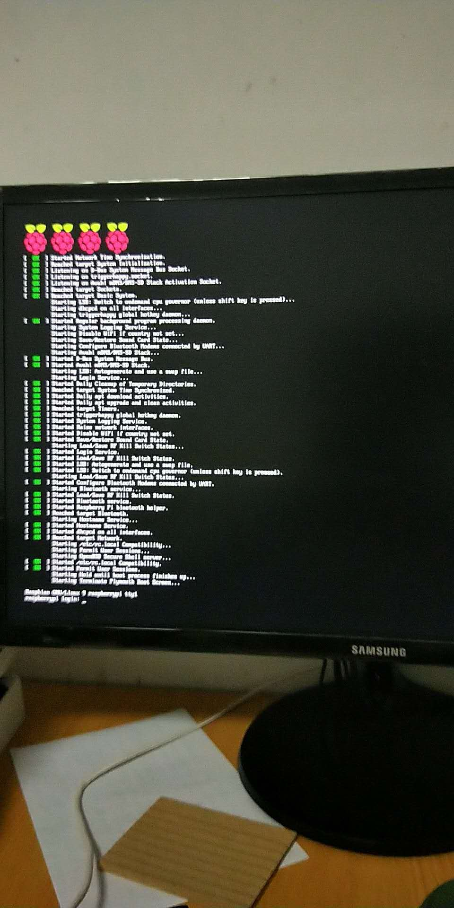
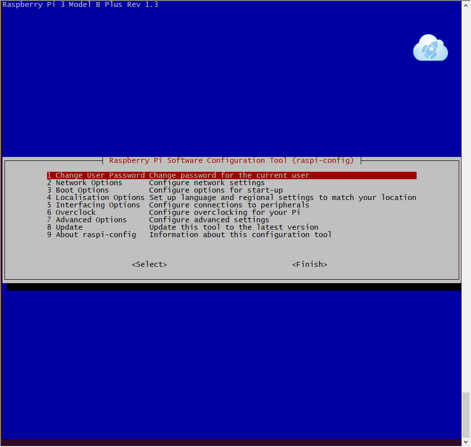
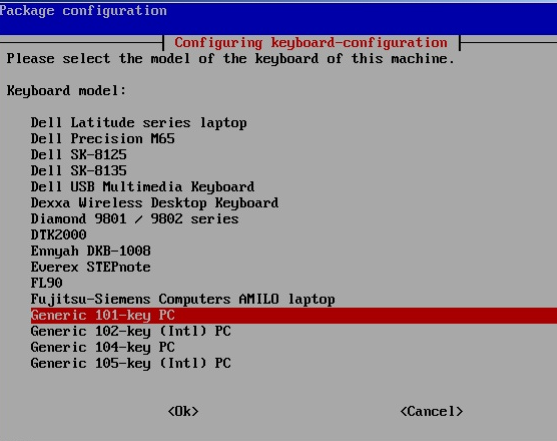
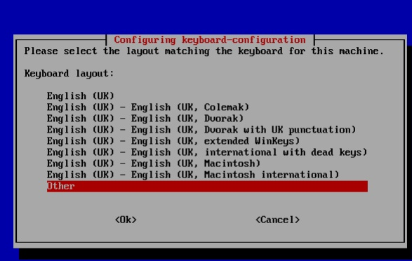
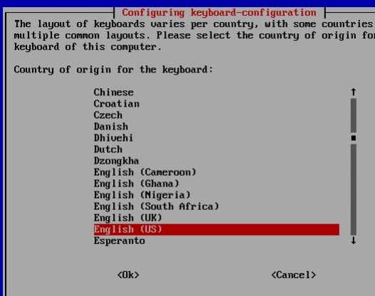
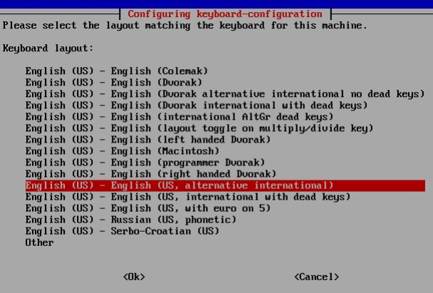

## 1. 无线网络设置

- 配置隐藏wifi密码

  ```shell
  #在文件底部添加(修改wifi_name和wifi_password)
  pi@raspberrypi:~ $ sudo cat >> /etc/wpa_supplicant/wpa_supplicant.conf
  network={
          ssid="wifi_name" 
          scan_ssid=1
          psk="wifi_password"
  }
  ```

- 配置无线静态ip

  ```shell
  #在文件底部添加
  pi@raspberrypi:~ $ sudo cat >> /etc/dhcpcd.conf
  interface wlan0
  static ip_address=192.168.0.103/24
  static routers=192.168.0.1
  static domain_name_servers=114.114.114.114
  ```

- 重启

  ```shell
  $ sudo reboot
  ```

<!--more-->

## 2. 启动ssh服务

在网上看了很多人的设置，都是将sd卡里面的ssh.txt文件后缀去掉改为ssh。太low了，感觉也不靠谱

试了一个方法[树莓派新系统SSH连接被拒绝的解决方法](http://shumeipai.nxez.com/2017/02/27/raspbian-ssh-connection-refused.html)，亲测可行，直接通过命令来设置才是正解

```shell
$ sudo systemctl start ssh.service
#设置开机自启
#将sudo systemctl start ssh.service添加到/etc/rc.local exit 0上一行
```

# 3. 更新换国内源

```shell
#备份源文件
$ sudo cp /etc/apt/sources.list /etc/apt/sources.list.bak
$ sudo cp /etc/apt/sources.list.d/raspi.list /etc/apt/sources.list.d/raspi.list.bak

#将原来文件中的所有内容注释掉，添加下面的源到/etc/apt/sources.list
deb http://mirrors.ustc.edu.cn/raspbian/raspbian/ jessie main contrib non-free rpi
#将下面的源添加到/etc/apt/sources.list.d/raspi.list
deb http://mirrors.ustc.edu.cn/archive.raspberrypi.org/debian/ jessie main ui
$ sudo apt-get update #更新软件源
```

参考:[树莓派3b更换为国内源](https://blog.csdn.net/MrYarnell/article/details/80165920)

# 4. 查看树莓派的linux版本

```shell
$ lsb_release -a
No LSB modules are available.
Distributor ID: Raspbian
Description:    Raspbian GNU/Linux 9.4 (stretch)
Release:        9.4
Codename:       stretch
$ uname -a #查看系统内核版本
Linux raspberrypi 4.14.50-v7+ #1122 SMP Tue Jun 19 12:26:26 BST 2018 armv7l GNU/Linux
```

# 5. 安装shaodowsocks

****

- pip方式安装

```shell
$ sudo apt-get install python-pip python-gevent python-m2crypto
$ sudo pip install shadowsocks
$ sudo vim /etc/shadowsocks/config.json
#将下面的配置文件添加进去，修改对应的server,server_port,local_address,password
{
"server":"www.abc1234",
"server_port":12800,
"local_address":"0.0.0.0",
"local_port":1080,
"password":"123456",
"timeout":600,
"method":"aes-256-cfb"
}
#/usr/local/lib/python2.7/dist-packages/shadowsocks/crypto/openssl.py 将此文件中的52行和111行中的cleanup更新为reset后，再尝试启动。
#启动shadowsocks,用which sslocal查看sslocal位置
$ sudo /usr/local/bin/sslocal -c /etc/shadowsocks/config.json -d start

#设置开机启动
$ sudo权限编辑/etc/rc.local
#在最后exit 0的上一行添加sudo /usr/local/bin/sslocal -c /etc/shadowsocks/config.json -d start,注意不同方式安装的文件位置不同，请将/usr/bin/sslocal用实际的位置替换
```

参考:

- [树莓派通过Shadowsocks科学上网方法](https://blog.lyz810.com/article/2017/01/raspberrypi-shadowsocks-config-guide/)
- 通过pip方式安装报错[AttributeError: /usr/lib/arm-linux-gnueabihf/libcrypto.so.1.1: undefined symbol: EVP_CIPHER_CTX_cleanup](https://github.com/shadowsocks/shadowsocks/issues/946)
- [树莓派SSH连接-SSH服务安装与开机自动启动](https://blog.csdn.net/qq813480700/article/details/71597808)

# 6. 搭建git服务器

参见笔记:[在服务器上添加git用户](https://ljessons.github.io/2018/08/23/%E5%9C%A8linux%E4%B8%8A%E6%90%AD%E5%BB%BAgit%E6%9C%8D%E5%8A%A1%E5%99%A8/)

```shell
$ sudo vim /etc/hostname #将raspberrypi改为gitpi就可以，可以将主机名改为gitpi
```

# 7. 重装树莓派系统

如何不用读卡器格式化烧录系统就重装系统呢，下面这个链接就是通过网络下载的方式，远程ssh操作树莓派重装的系统。

参考:[Reinstall your Raspberry over the Network](https://blog.webernetz.net/reinstall-your-raspberry-over-the-network/)

- 通过网络安装树莓派系统

```shell
$ echo 1 > /proc/sys/kernel/sysrq
$ curl -L http://downloads.raspberrypi.org/raspbian_lite_latest | funzip | dd bs=4M of=/dev/mmcblk0
#下面这一步做完，就得用重新插拔下电源线，连接显示器了。
$ echo b > /proc/sysrq-trigger
```

下面这幅图是安装完系统后的样子，没有界面



- 将树莓派默认的长长的密码改成你自己想定义的

  ```shell
  $ sudo raspi-config
  ```

  

- 在第4个选项里面分别设置locale（设置ZN-UTF8）和时区(Asia,shanghai)，wifi-contry（CN-china）

- 由于双引号不能正常打出来，wifi也不能配置，选择上图的的第4个选项，配置键盘参数，选择截图里面红色高亮的选项

  

  





然后一路按OK。

退出后，重启系统。

参见[树莓派开箱配置之更改键盘布局](http://shumeipai.nxez.com/2017/11/13/raspberry-pi-change-the-keyboard-layout.html)

- 前面的键盘映射改了后，就可以输入双引号，然后就可以在文件中`/etc/wpa_supplicant/wpa_supplicant.conf`配置无线wifi了，参见前面的第一节**无线网络设置**，不再赘述
- 在raspi-config中的第5个Interface设置中设置ssh启动
- 重启安装vim，`sudo apt-get install vim`，记住ip
- 拔掉树莓派hdmi线，然后用刚才的ip通过本地windows ssh远程连接树莓派
- 配置无线网络静态ip
- 更换国内源

最终这次重装树莓派系统算是完成，图形界面的问题先暂时放下吧。