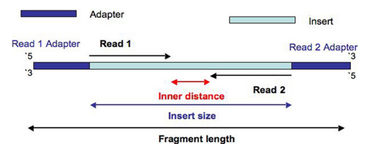

1. 人类基因组约有3亿碱基对，3Gbp

2. bp: base pair 碱基对

3. SE：高通量测序的策略，SE (Single End)，指单端测序；
   PE (Paired End), 指双端测序。

4. 外显子（Exon）：是真核生物基因的一部分，它在剪接后仍会被保存下来，并可在蛋白质生物合成过程中被表达为蛋白质。 而内含子则会在剪接过程中被除去。所有的外显子一同组成了遗传信息，该信息会体现在蛋白质上。

5. 内含子（Intron）：是一个基因中非编码DNA片段，它分开相邻的外显子。更精确的定义是：内含子是阻断基因线性表达的序列。DNA上的内含子会被转录到前体RNA中，但RNA上的内含子会在RNA离开细胞核进行转译前被剪除。在成熟mRNA被保留下来的基因部分被称为外显子。真核生物的基因含有外显子和内含子，是前者区别原核生物的特征之一。

6. 编码区:基因的编码区（Coding region），亦称为“编码序列”（Coding sequence）或“CDS”（Coding DNA Sequence），是指DNA或RNA中由外显子组成，编码蛋白质的部分。该区域的边界范围从靠近5′末端的起始密码子开始，到靠近3′末端的终止密码子为止。mRNA的编码区范围位于5′非翻译区和部分同样为外显子的3′非翻译区之间。

7. 非翻译区:非翻译区（UTR，untranslated region）在分子遗传学中，是指任意一个位于mRNA链编码序列两端的片段。如果其位于5′端，则称为5′非翻译区（或“前导序列”）, 反之若位于3′端，则称为3′非翻译区（或“尾随序列”）。

8. Q-score:碱基质量值，是碱基识别（ Base Calling ）出错的概率的整数映射。碱基质量值越高，Q30 指碱基质量值为30，即对应的测序错误率为0.1%，碱基的精确度为99.9%。

9. 参考基因组：有参转录组的分析基础，通过与参考基因组比对进行转录组分析，区别于无参考基因组而进行de novo 组装的转录组测序，完整的参考基因组信息包括序列信息（.fasta 文件）和基因注释信息（.gff 文件）。基因组注释(Genome annotation) 是利用生物信息学方法和工具,对基因组所有基因的生物学功能进行高通量注释,是当前功能基因组学研究的一个热点。基因组注释的研究内容包括基因识别和基因功能注释两个方面。

10. Reads：是指高通量测序平台读取的序列信息。

11. adaptor：接头，用于上机测序。建库时引入的接头序列与测序芯片(flow cell ) 上固定的接头相互识别。

12. Transcript：转录本，是由一条基因通过转录形成的一种或多种可供编码蛋白质的成熟的 mRNA 。一条基因通过内含子的不同剪接可构成不同的转录本。

13. 反义链/正义链（antisense strand/sense strand）：在双链DNA中，用来转录mRNA的DNA链称为模板链(template strand)，不用于转录的链则称为非模板链（nontemplate strand）。根据碱基互补配对原则，转录出的mRNA链的碱基序列与非模板链的碱基序列一致，惟一不同的是，非模板链中的T mRNA链中全部置换成了U。由于非模板链的碱基序列实际上代表了 mRNA的碱基序列（只不过在mRNA中T换成了U），因此非模板链又被称为编码链（coding strand）,有义链（sense strand）和克里克链(crick strand)，而用来转录mRNA的DNA链被称为非编码链（anticoding strand）或反义链（antisense strand）或沃森链(watson strand)。 

14. hgvs权威注释官方网站：（http://varnomen.hgvs.org/recommendations/DNA/variant/deletion/）

15. annovar注释CNV：http://annovar.openbioinformatics.org/en/latest/user-guide/download/

    其他注释软件：https://omictools.com/cnv-annotation-category

    cDNA与CDS区别，ORF（开放阅读框是什么，ORF是cDNA的CDS区域）：http://blog.sciencenet.cn/blog-247480-482935.html

16. annovar注释：[突变注释工具SnpEff,Annovar,VEP,oncotator比较分析](http://www.jianshu.com/p/6284f57664b9)

    [annovar对人类基因组和非人类基因组variants注释流程](http://blog.csdn.net/u013816205/article/details/51262289)

17. 使用VEP注释，安装配置教程:

    > ```shell
    > $ git clone https://github.com/Ensembl/ensembl-vep.git
    > $ cd ensembl-vep
    > $ perl INSTALL.pl
    > #ERROR: DBI module not found. VEP requires the DBI perl module to function
    > #安装DBI：http://www.cnblogs.com/bo5509/p/3519033.html
    > tar -xvf DBI-XXX.tar.gz
    > cd DBI-XXX
    > perl Makefile.PL
    > make
    > make test
    > make install
    > ```

18. 转换(transitions)和颠换(transversions)的区别：

    - 转换：DNA分子中的嘌呤被嘌呤或嘧啶被嘧啶替换。
    - 颠换：DNA分子中的嘌呤被嘧啶或嘧啶被嘌呤替换。

19. Heterozygosity计算:http://www.uwyo.edu/dbmcd/molmark/lect04/lect4.html

    ```python
    def heterozygosity(self):
        """
    	Heterozygosity of a site. Heterozygosity gives the probability that
    	two randomly chosen chromosomes from the population have different
    	alleles, giving a measure of the degree of polymorphism in a population.
    	If there are i alleles with frequency p_i, H=1-sum_i(p_i^2)
    	"""
        allele_freqs = [1-sum(self.aaf)] + self.aaf
        return 1 - sum([x**2 for x in allele_freqs])
    ```

20. FM-index：https://en.wikipedia.org/wiki/FM-index（by lindadou）

21. Difference between CDS and cDNA:https://biology.stackexchange.com/questions/11377/difference-between-cds-and-cdna

    > cDNA包括UTR区域

22. fastqc安装：http://m.www.cnblogs.com/OA-maque/p/4835036.html

    ```shell
    cd FastQC/
    chmod 755 fastqc			
    export PATH=/mnt/hgfs/VM_Share/software/FastQC/:$PATH
    fastqc --help
    ```

23. fastqc绘制碱基质量分数分布图


> fastqc [-o output dir][--(no)extract] [-f fastq|bam|sam]
> [-c contaminant file] seqfile1 .. seqfileN
>
> -o用来指定输出文件的所在目录，注意是不能自动新建目录的。输出的结果是.zip文件，默认自动解压缩，命令里加上--noextract则不解压缩。-f用来强制指定输入文件格式，默认会自动检测。-c用来指定一个contaminant文件，fastqc会把overrepresented sequences往这个contaminant文件里搜索.

24. samtools tview 输出理解：

    - 逗号，点号：https://en.wikipedia.org/wiki/Pileup_format

    - 用一个字母表示read中可能出现的snp的情况：http://www.bioinformatics.org/sms/iupac.html

    - read中除了ATCG这四个可能的字母还有可能出现像N这种未检测到的碱基

    - read reverse strand 在samtools tview中用小写表示

    - mate reverse strand 用大写表示

    - 按b：按颜色显示碱基质量

      > 质量分数版本：L - Illumina 1.8+ Phred+33,  raw reads typically (0, 41)：https://en.wikipedia.org/wiki/FASTQ_format
      > 0~10蓝色、10-20：绿色、20-30：黄色、30-41：白色

    - 按c：显示cs color

25. samtools使用

    ```shell
    #将bam文件转换为sam文件
    $ samtools view -h -o out.sam out.bam
    #将sam文件转换为bam文件
    $ samtools view -bS out.bam > out.bam #-b：表示输出bam格式，-S:表示自动检测输入文件数据格式
    $ samtools index out.bam #对bam文件添加索引
    #samtools查询read与查询染色体序列，变异数据库位点信息方式一致
    $ samtools view realn.bam chr1:156844033-156860416
    #samtools直接提取某个基因组区域的碱基序列：
    $ samtools faidx hg19.fa chr1:1-10（1-based，第一个碱基是从1开始）
    #输出：
    >chr1:1-10
    NNNNNNNNNN
    ```

26. tabix为vcf文件建立索引

    ```shell
    #先用tabix自带的bgzip生成.gz文件
    $ /mnt/hgfs/VM_Share/software/tabix/tabix-0.2.6/bgzip -c /mnt/hgfs/VM_Share/data/hg19_UCSC/GATK_bundle/1000G_phase1.indels.hg19.vcf > /mnt/hgfs/VM_Share/data/hg19_UCSC/GATK_bundle/1000G_phase1.indels.hg19.vcf.gz
    #对这个.gz文件建立索引
    $ /mnt/hgfs/VM_Share/software/tabix/tabix-0.2.6/tabix -p vcf /mnt/hgfs/VM_Share/data/hg19_UCSC/GATK_bundle/1000G_phase1.indels.hg19.vcf.gz
    #使用tabix查询变异数据库vcf文件中chr1上10000-30000的变异信息
    $ tabix 1000G_phase1.indels.hg19.vcf.gz chr1:10000-30000
    #chr1 13957 . TC T 28 PASS AC=35;AF=0.02;AFR_AF=0.02;AMR_AF=0.02;AN=2184;ASN_AF=0.01;AVGPOST=0.8711;ERATE=0.0065;EUR_AF=0.02;LDAF=0.0788;RSQ=0.2501;THETA=0.0100;VT=INDEL
    ```

27. 合并vcf文件

    ```shell
    #先生成tabix所建立的vcf压缩格式
    bgzip -c x.vcf > x.vcf.gz #生成x.vcf文件的压缩格式x.vcf.gz
    bgzip -c y.vcf > y.vcf.gz
    tabix -p vcf x.vcf.gz #生成x.vcf.gz的索引文件x.vcf.gz.tbi
    tabix -p vcf y.vcf.gz
    vcf_merge x.vcf.gz y.vcf.gz > merged.vcf
    #若只想要合并vcf文件的压缩格式可以通过管道用tabix的bgzip生成
    vcf-merge A.vcf.gz B.vcf.gz | bgzip -c > C.vcf.gz
    
    #解压缩vcf.gz文件
    bgzip -d xxx.vcf.gz
    
    #新版的tabix已经集成到htslib里面了，可以直接在htslib中使用tabix
    ## how to merge vcf file
    1. install htslib
        git clone https://github.com/samtools/htslib.git
        cd ./htslib/
        autoheader     # If using configure, generate the header template...
        autoconf       # ...and configure script (or use autoreconf to do both)
        ./configure    # Optional, needed for choosing optional functionality
        make
        sudo make install
    
    2. compress vcf to vcf.gz using tabix
        htslib/bgzip -c Mills_and_1000G_gold_standard.indels.hg19.vcf > Mills_and_1000G_gold_standard.indels.hg19.vcf.gz
        htslib/bgzip -c dbsnp_138.hg19.vcf > dbsnp_138.hg19.vcf.gz
        htslib/bgzip -c 1000G_phase1.indels.hg19.vcf > 1000G_phase1.indels.hg19.vcf.gz
    
        htslib/tabix -p vcf Mills_and_1000G_gold_standard.indels.hg19.vcf.gz
        htslib/tabix -p vcf dbsnp_138.hg19.vcf.gz
        htslib/tabix -p vcf 1000G_phase1.indels.hg19.vcf.gz
    
    3. install vcftools
        git clone https://github.com/vcftools/vcftools.git
        cd vcftools/
        ./autogen.sh
        ./configure
        make
        sudo make install
    
    4. merge vcf file
        vcftools/vcf-merge Mills_and_1000G_gold_standard.indels.hg19.vcf.gz \
        dbsnp_138.hg19.vcf.gz 1000G_phase1.indels.hg19.vcf.gz > Mills_dbsnp_1000G.vcf
        cd bqsr/
        python3 replaceVcfInfoWithPoint.py Mills_dbsnp_1000G.vcf Mills_dbsnp_1000G_simplify.vcf
        htslib/bgzip -c Mills_dbsnp_1000G_simplify.vcf > Mills_dbsnp_1000G_simplify.vcf.gz
        htslib/tabix -p vcf Mills_dbsnp_1000G_simplify.vcf.gz
    5. delete tmp file that is not used.
        rm Mills_and_1000G_gold_standard.indels.hg19.vcf.gz dbsnp_138.hg19.vcf.gz 1000G_phase1.indels.hg19.vcf.gz
        rm Mills_and_1000G_gold_standard.indels.hg19.vcf.gz.tbi dbsnp_138.hg19.vcf.gz.tbi 1000G_phase1.indels.hg19.vcf.gz.tbi
        rm Mills_dbsnp_1000G.vcf
    ```

    参见：[合并VCF文件 Merge VCF file](http://www.zxzyl.com/archives/740)

    [Question: How To Uncompress The 1000 Genome Vcf.Gz File](https://www.biostars.org/p/57015/)

28. tlen的理解:[Question: Insert Size And Fragment Size ? ](https://www.biostars.org/p/95803/)

    Insert_size = the sequence between adapters

    Fragment_size= Insert_size + Adapters

    

	​		